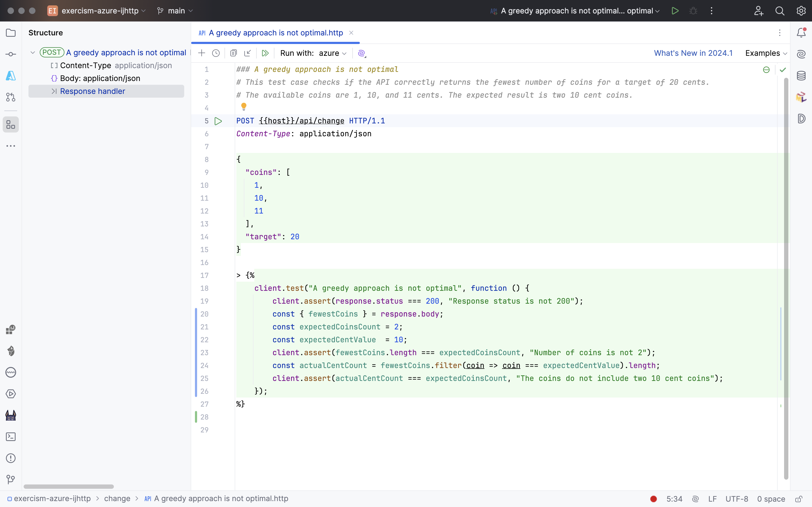
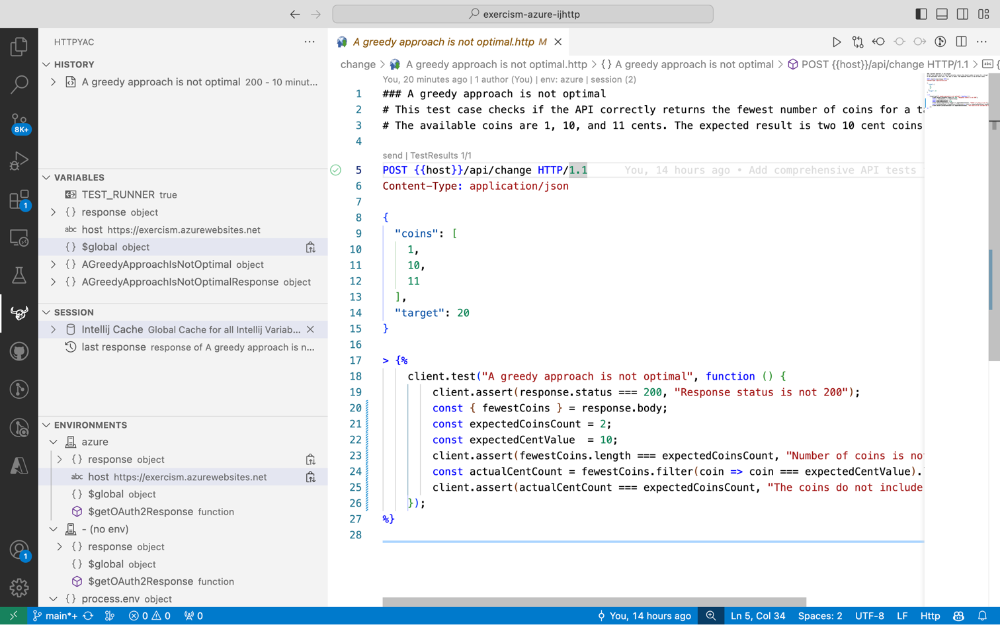
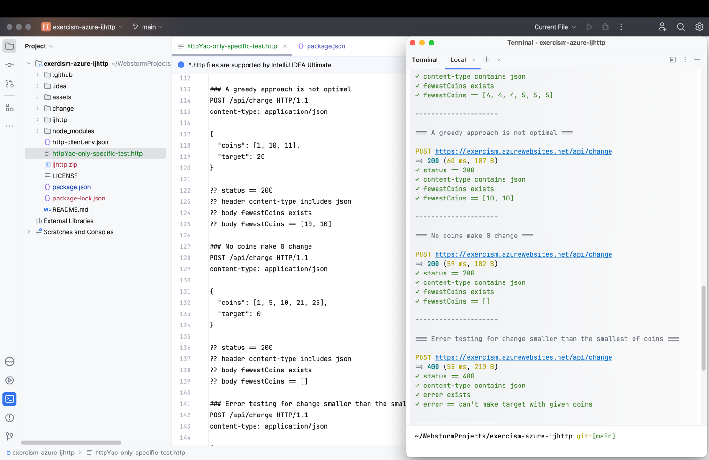
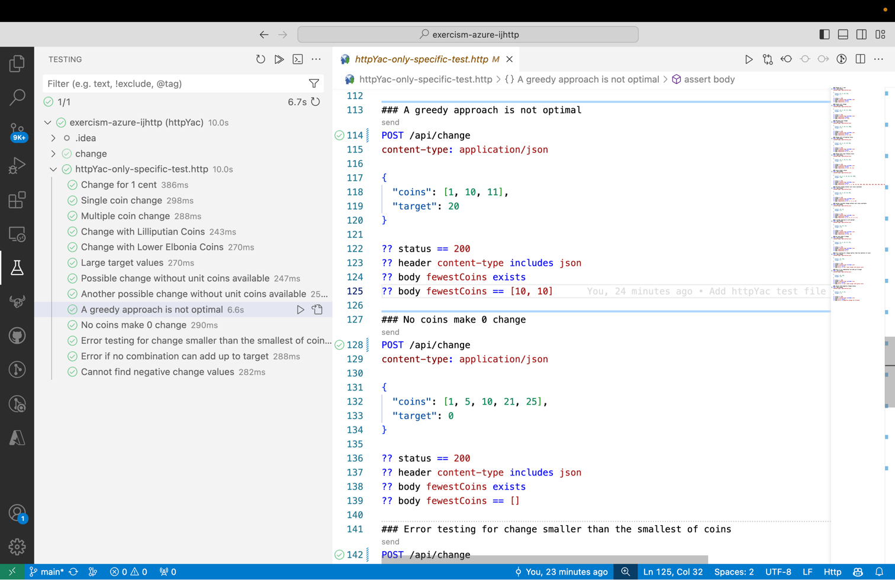

# API Testing with JetBrains HTTP Client and httpYac

This repository demonstrates how to create API tests using JetBrains HTTP Client and httpYac. These tests are designed for an Azure function that implements the "Change" exercise from Exercism.org.

## Task Description

The task is to create an API that calculates the smallest number of coins needed to make a given amount of change. The API should be able to handle any set of coin denominations. For example, it should be able to handle American coins (1, 5, 10, 25), as well as arbitrary denominations like [1, 4, 15, 20, 50].

The API is implemented as an Azure function and the code can be found in this repository: https://github.com/rabestro/exercism-azure-functions

The detailed description of the exercise can be found here: https://exercism.org/exercises/change

## Test Cases

The test cases are designed to cover a variety of scenarios, including:

- Making change for 1 cent
- Making change with a single coin
- Making change with multiple coins
- Making change with Lilliputian coins
- Making change with Lower Elbonia coins
- Making change for large target values
- Making change without unit coins available
- Making change when a greedy approach is not optimal
- Making no change (0 cents)
- Error handling for change smaller than the smallest of coins
- Error handling when no combination can add up to target
- Error handling for negative change values

Each test case sends a POST request to the `/api/change` endpoint with a JSON payload specifying the available coins and the target amount of change. The tests then check the response status and the body of the response.

All test cases are generated automatically from the canonical data of this exercise, which can be found at: https://github.com/exercism/problem-specifications/blob/main/exercises/change/canonical-data.json

## Running the Tests

To run the tests, you can use either JetBrains HTTP Client or httpYac. Both clients are compatible and can run the same set of tests. Instructions for running the tests with each client can be found in the respective sections of this README.

## JetBrains HTTP Client

The tests can be run directly from JetBrains Idea Ultimate or by installing CLI. Instructions for installing and using the CLI can be found here: https://www.jetbrains.com/help/idea/http-client-cli.html



## httpYac

The tests can be run directly from Visual Code or by CLI.
To run the tests, use the following commands:

```bash
npm install
npm run test
```



## httpYac Simple Assertions

```bash
npm run httpyac
```

### Intellij Community



### Visual Code



## GitHub Actions

Two GitHub Actions have been added to the repository to run the tests:

- api-tests-ijhttp.yaml
- api-tests-httpyac.yaml
- api-tests-assertions.yaml

These actions can be run manually whenever needed.

## License

This project is licensed under the ISC license.
